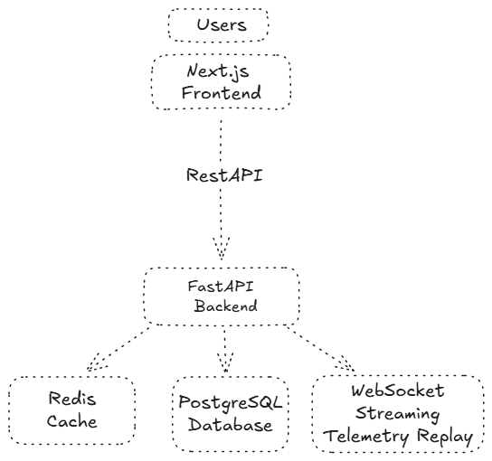
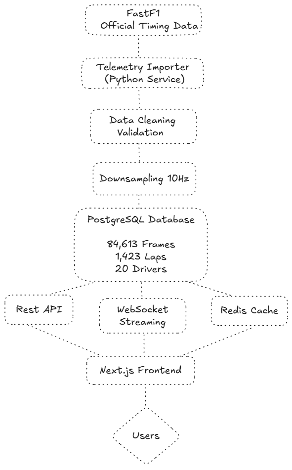
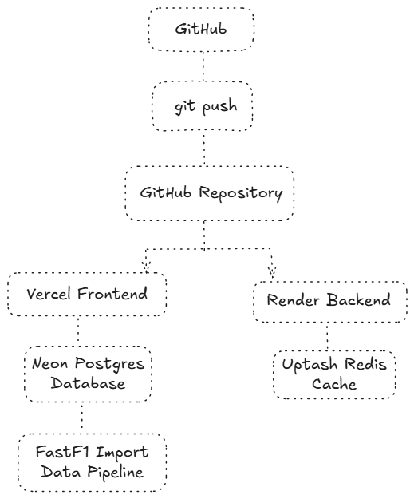
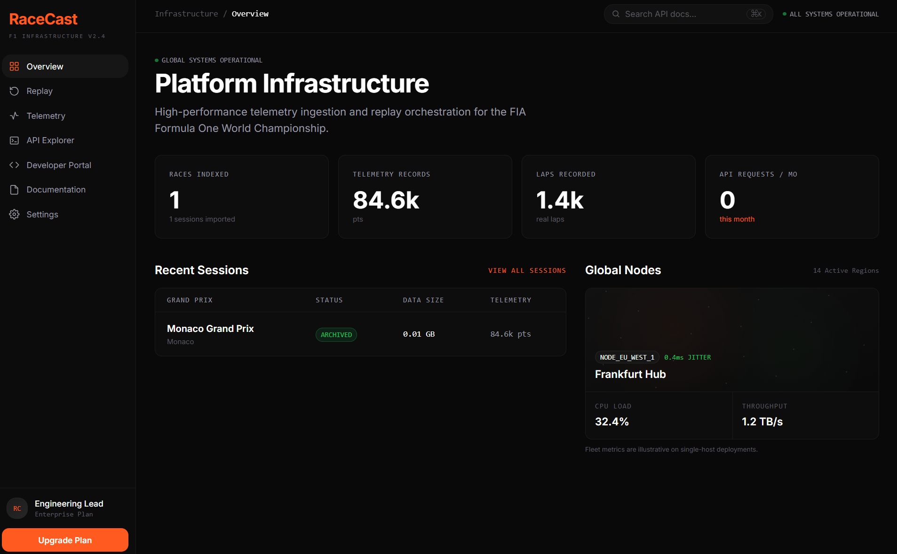
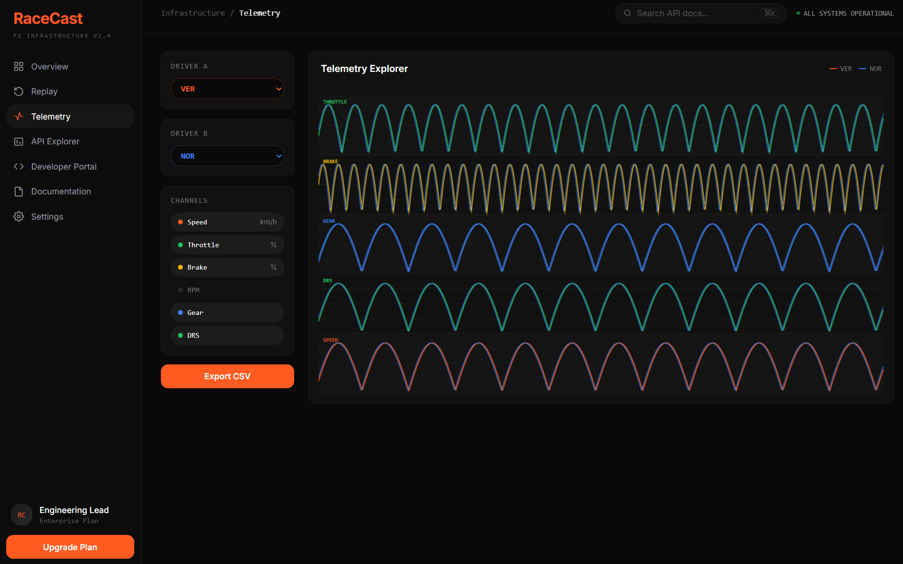
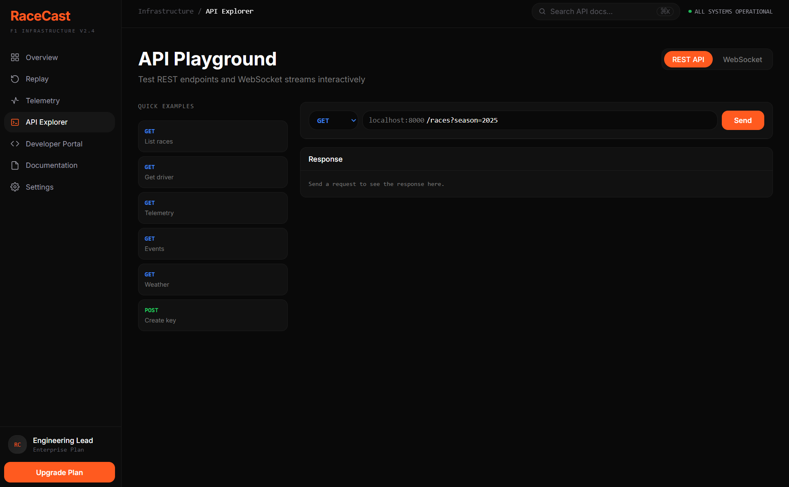

# RaceCast

**Formula 1 Telemetry Infrastructure Platform**

RaceCast is a full-stack developer platform that transforms raw Formula 1 telemetry into accessible APIs, streaming services, and replay experiences. The platform enables developers, analysts, and AI teams to access historical race telemetry through REST APIs and WebSocket streaming without needing to build their own ingestion pipelines.

## Overview

RaceCast was designed to solve a common problem: Formula 1 telemetry data is available through FastF1 but requires significant domain knowledge, custom infrastructure, and data engineering effort before it can be used for analytics, applications, or machine learning.

Rather than building another dashboard, RaceCast focuses on the infrastructure layer, providing a developer-first experience similar to modern API platforms.

### Project Highlights

* 84,613 telemetry frames processed
* 1,423 race laps imported
* 20 Formula 1 drivers
* 30+ API endpoints
* REST API + WebSocket streaming
* Production deployment on cloud infrastructure

## Architecture

### System Architecture



### Data Pipeline



### Production Deployment



## Technical Stack

### Backend

* Python
* FastAPI
* SQLAlchemy
* PostgreSQL
* Redis
* WebSockets

### Frontend

* Next.js
* TypeScript
* Tailwind CSS

### Infrastructure

* Vercel
* Render
* Neon PostgreSQL
* Upstash Redis
* Docker
* GitHub

## Key Features

### Telemetry API

Access race telemetry including:

* Speed
* Throttle
* Brake
* Gear
* DRS
* Position data

### Historical Replay

Replay Formula 1 sessions using imported telemetry data and streaming endpoints.

### Developer Platform

* API Playground
* Documentation
* WebSocket Testing
* Developer Console
* Rate Limiting

### Data Engineering Pipeline

* Automated FastF1 ingestion
* Data validation
* Telemetry normalization
* 10Hz downsampling
* Bulk database import

## Production Engineering

During deployment, several production issues were identified and resolved, including:

* PostgreSQL SSL connectivity
* Cross-origin request handling
* Environment configuration management
* Container deployment configuration

## Screenshots

### Dashboard



### Telemetry Explorer



### API Playground



## Case Studies

### AI Product Manager

This case study focuses on product strategy, user needs, roadmap planning, success metrics, and product decisions.

Location:

```text
case-studies/ai-product-manager/
```

### Forward Deployed Engineer

This case study focuses on architecture, deployment, production debugging, infrastructure design, and technical ownership.

Location:

```text
case-studies/forward-deployed-engineer/
```

## Roadmap

See:

```text
ROADMAP.md
```

## Repository Structure

```text
RaceCast/
│
├── architecture/
├── screenshots/
├── case-studies/
├── backend/
├── frontend/
├── ROADMAP.md
└── README.md
```
